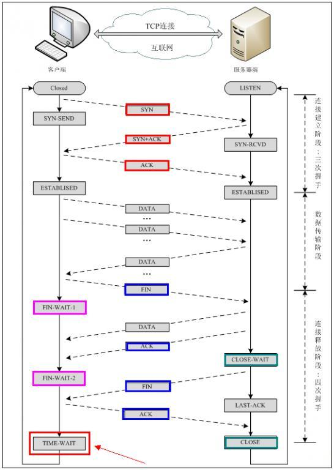

**在TCP和UDP中，采用5个信息来识别一个通信：源IP，目标IP，源端口，目标端口，协议**只要某一样不同就会被认为是其他通信。
端口号在传输层相当于地址，通过端口号来识别应用程序。
端口的确定：标准既定端口号（如http80，https443，ftp20，21，SMTP25，DNS53），以及动态分配法（由操作系统分配4w9到6w5）
不同的传输协议可以通过相同的端口号传输

二者区别：
1. 面向无连接/有连接（需要建立连接、无连接的可以不需，可以用于多播，广播等）
2. 可靠性（UDP不关心是否收到数据，TCP采用超时重发、分片、流量控制，拥塞管理等保证可靠性）
3. 高效性（UDP高效，报文段字节少，不需要建立连接），如DNS

# UDP
user datagram protocol
UDP协议是面向无连接的，也就是说不需要再正式传递数据之前连接双方，不保证数据的完整性和有序性
没有任何控制流量的算法，比TCP更加轻便

## 面向无连接
UDP不需要想TCP一样需要三次握手建立连接
- 在发送端，应用层将数据传递给传输层UDP协议，UDP只会给数据增加一个UDP头识别，然后传递给网络层
- 在接收端，网络层将数据传递给传输层，UDP只取出IP报文头就传递给应用层，不会任何拼接操作(不会分段)

## 不可靠性
发送数据不会关心对方是否已经正确接收到数据了。适用于某一些实时性要求高的场所

## 高效
UDP头部开销小，只有8byte，相比TCP20byte要小，传输报文的时候很高效

原因：
1. 无需建立连接
2. 不需要确认收到数据
3. 没有超时重发机制
4. 没有流量控制和拥塞控制
5. 报文段小

UDP头部包含以下数据：
- 两个16位的端口号，分别为源端口和目标端口
- 整个报文的长度Length
- 整个数据报文的校验和（IPv4可选字段），该字段用于发现头部信息和数据的错误

## 传输方式
UDP不止支持一对一的传输方式，同时支持一对多，多对多，多对一的方式。（单播，多播，广播）

# TCP
TCP建立连接和断开连接都需要进行握手，在传输数据的过程中，通过各种算法保证数据的可靠性。相比UDP不那么高效
TCP是面向连接的，可靠的流协议。

## 可靠性
1. 通过三次握手来建立连接
2. 将数据截断为合理的长度（按照字节编号，合理分片），使数据包保持不变
3. 超时重发机制（定时器超时前收不到母的段的确认报文段将重发）
4. 对于收到的请求，给出确认相应（会推迟几分之一秒，用包的校验）
5. 校验出包出错则丢弃报文段，不响应，让对方超时重发
6. 丢弃重复的数据
7. 进行流量控制
8. 拥塞控制

## 头部
- 2字节 * 2 源端口以及目标端口
- 4byte Sequence number 这个序号保证TCP传输的有序性
- 4byte Acknowledgment number（if ACK set） 这个序号表示数据接收端期望接受的下一个字节的编号是多少，同时表示上一个序号的数据已经收到
- 2 byte ？？标识符，每个占1bit
- 2 byte window size 窗口大小，表示还能接受多少字节的数据，用于流量控制
- 2 byte checksum
- 2 byte Urgent pointer（if URG set），紧急指针

标识符：
- URG=1,本数据包部分包含紧急信息，是一个高优先级的数据报文。紧急数据一定位于当前数据包数据部分的最前面，紧急指针表明了紧急数据的尾部
- ACK=1 表示确认好字段有效，TCP规定在连接建立之后传送的所有报文段都必须把ACK置为1
- PSH=1 该字段表示接收端应该立即将数据push给应用层，而不是等到缓冲区满了之后再提交
- RST=1 表示当前TCP连接出现严重问题，可能需要重新建立TCP连接，也可以拒绝非法报文段和拒绝连接请求
- SYN=1 SYN=1,ACK=0表示这是一个连接请求报文；当SYN=1,ACK=1表示这个一个同意连接的应答报文
- FIN=1 表示这是一个释放连接的请求报文

## 状态机

### 建立链接的三次握手
客户端 发送 SYN
服务端 接收SYN，并返回 SYN + ACK，如果服务器无法立刻建立连接，返回RST报文报文表示重置
客户端 接收SYN + ACK，返回ACK

期初上方都处于`CLOSED`状态。在通信开始之前，双方会创建`TCB`。服务器创建完`TCB`之后就会进入`LISTEN`状态，单带客户端发送数据

第一次握手：
客户端发送一个`SYN`，然后进入`SYN-SENT`状态
第二次握手
服务端接收到`SYN`之后，返回`SYN + ACK`（包含数据初始序号）表示同意连接，发送之后进入`SYN-RECEIVED`状态
第三次握手
客户端接收到`SYN + ACK`之后，向服务器发送一个确认报文`ACK`，发送之后进入`ESTABLISHED`，服务端接收到这个应答之后也进入`ESTABLISHED`状态
> 第三次握手可以包含数据

需要第三次握手的原因是因为防止失效的连接请求报文段被服务端接收的情况：
假设客户端发送一个A请求，因为网络延迟，导致其又发了第二个请求B，请求B与服务端正确建立连接，通信结束后，如果请求A到达服务端，服务端可能会认为这是另一个通信请求，如果两步握手，服务端发送`SYN+ACK`之后进入`ESTABLISHED`状态，就需要一直等待客户端，浪费资源

MSS（Max Segment Size）是最大消息长度，理想状态下，最大消息长度正好是IP中不会被分片处理的最大数据长度
在握手的时候，两端的主机可以计算出这个数值，在TCP首部写入自己接口能够适应的MSS的大小。

### 断开连接的四次挥手

发送端：发送`FIN`请求释放连接，进入`FIN_WAIT_1`状态
接收端：接收到`FIN`请求，告诉应用层释放TCP连接。然后发送`ACK`包，表示可以继续发送数据
发送端：发送端接收到`ACK`包之后，进入`FIN_WAIT_2`状态
接收端：当确认数据已经发送完毕了之后，发送`FIN`释放请求，然后进入`LAST_ACK`状态
发送端：收到`FIN`释放请求，发送`ACK`应答，然后进入`TIME_WAIT`状态，持续2MSL（最大段生存期），如果此时没有重发请求时，便进入`CLOSED`状态。
接收端：接收端接收到`ACK`应答，也进入`CLOASED`状态

### 重发超时
重发超时使指在重发数据之前，等待确认应答到来的那个特定的时间间隔。如果超过了这个时间仍没有收到确认应答，发送端将数据进行重发。

重发的时间长度使通过每次发包的时候都计算一下往返需要的时间以及偏差，将这个时间和偏差加起来，重发超时的时间就是比这个时间大一点。（因为有一些包是通过不同路径来的，所以偏差可能会大，也可能会小，为了使一些偏差大的也可以到达，不浪费网络流量）

如果数据重发了之后还是没有应答，则继续发送，等待时间将会以2倍，4倍等指数函数延长。但是数据包不会无限重发，如果重发超过了一定次数之后就会判断网络或对端主机出现了异常，强制关闭连接。并且通知应用程序强行终止。

## 流量控制
### 滑动窗口
在TCP中，两端其实都维护着窗口：发送端窗口和接收端窗口

动态调整窗口：
发送端窗口包含着已经发送但未收到应答的数据和可以发送但是未发送的数据，其中发送窗口是根据**接收窗口的剩余大小**决定的
接收方会把当前接收窗口的剩余带下写进应答报文，发送端会根据这个来调整发送窗口的值。
当发送端接收到应答之后，会将发送窗口进行滑动（它帮助TCP实现了流量控制功能，接收方通过告知发送方还可以发送多少数据来保证接收方能够来得及接收数据，防止出现接收方宽带已满，但是发送方还一直发送数据的情况）

#### Zero 窗口
在发送报文的时候，可能会出现零窗口的情况，在这种情况下，发送端会停止发送数据，并启动persistent timer，该定时器会定时发送请求到对端，让其告知窗口大小。在重试超过一定次数之后，可能会终端TCP连接。

在窗口在一定程度上大的时候，即使少部分确认应答丢失也不会重发，可以通过确认下一个应答来确认。
如果连续3次收到同一个应答，就会对对应的数据进行重发。（高速重发机制）

### 传输效率

## 拥塞处理
拥塞处理和流量控制不同，后者作用于接收方，保证接收方来得及接收数据。前者作用于网络，防止过多的数据拥塞网络，避免出现网络负载过大的情况。
算法：
- 慢启动算法
- 拥塞避免
- 快速重传
- 快速恢复

### 慢开始算法
在传输开始的将发送窗口慢慢指数扩大，从而避免一开始传输大量数据导致网络拥塞。
1. 连接初期设置拥塞窗口(Congestion Window)为1 MSS（一个分段的最大数据量）
2. 每过一个RTT就将窗口大小乘2
3. 当窗口大小大于一个阈值时就会启动拥塞避免算法
（TCP在通信开始的时候没有设置阈值，只有在第一次重传超时的时候才会设置为当前窗口的一半）

### 拥塞避免算法
拥塞避免算法每过一个RTT窗口大小只加1，这样能够避免指数级增长导致网络拥塞，慢慢将大小调整到最佳值

在传输过程中可能定时器超时的情况，这时候TCP认为网络拥塞了，会马上进行以下步骤：
1. 将阈值设为当前拥塞窗口的一半
2. 将拥塞窗口设为1 MSS
3. 启动慢开始算法

### 快速重传
快速重传一般和快速恢复一起出现。
如果接收端收到的报文出现失序的情况，接收端只会恢复最后一个顺序正确的报文序号。如果发送端收到三个重复的ACK，无需等待定时器超时而是直接启动快速重传算法。

TCP Reno算法：
- 拥塞窗口减半
- 将阈值设置为当前拥塞窗口
- 进入快恢复阶段（一旦收到一个新的ACK答复就退出该阶段）
- 使用拥塞避免算法

TCP New Ren 改进后的快恢复：
TCP发送端会记下三个重复ACK的分段的最大序号

假设有一个1 - 10十个序号的报文，如果丢失了3 和 7的报文，那么该分段最大序号就是10。
这时候重发序号为3的报文，接收方接收后发送7的应答，此时TCP继续发送序号为7的报文，接收方接收后发送ACK序号为11的应答，此时发送端可以认为这个分段接收端已经顺利接收，接下来退出快恢复阶段。

## TCP异常

1. 与一个不存在的端口建立连接
服务器端口没有监听这个端口，那么客户端发送的请求(SYN)就会在服务器的系统内出发RST分节的条件，表示出错。客户端的TCP接收到这个RST之后就会放弃连接，并且返回应用程序一个错误。

2. 与不存在主机上的端口建立连接
TCP没有任何相应，6s后会继续发送一个SYN，如果还是没有反应，24S后再发送一个，总共等待75s。如果还没有收到相应就会返回ETIMEOUT错误

3. Server进程被塞满
这时候连接可以正常建立（因为建立连接的进程对于应用程序来说是不可见的），客户端可以发数据给服务端，同时服务端TCP会应答ACK表示已经收到分节（数据在内核缓冲区，但是因为应用程序进程被阻塞，所以不能将数据从内核缓冲区复制到应用层序的缓冲区）

4. kill Server
在程序正常退出的时候会自动调用close函数关闭它打开的文件描述符，相当于服务器主动关闭连接（发送一个FIN给客户端）
客户端需要配合对端关闭连接

5. Server所在主机关机
系统关闭时，init进程会给所有进程发送SIGTERM信号，等待一段时间（5-20s），再给所有仍在运行的进程发送SIGKILL信号。当服务器进程死掉时，会关闭所有的文件描述符。

6. Server进程所在的主机宕机
客户端持续重传分节，试图从服务器中接受到一个ACK，重传数次之后，大约4-10分钟停止，返回一个ETIMEOUT错误

TCP提供一个SO_KEEPALVE的socket选项，每隔一段时间发送对方一个心跳包，当对方没有相应的时候会以更短的时间间隔发送，一段时间之后仍无反应就断开这个连接。

# TCP提供可靠的数据传输
实行顺序控制或者重发控制机制，还具备流量控制，拥塞控制，提高网络利用率等众多功能

# ARQ 协议
(Automatic Repeat-reQuest) 自动重传请求
通过**确认**和**超时**两个机制，实现可靠的信息传输

- 停止等待ARQ协议
- 连续ARQ协议

## 停止等待ARQ协议
### 正常传输过程
只要A向B发送一段报文，都要停止发送并启动一个计时器，等待对端回应，在定时器时间内接收到对端应答就取消定时器并发送下一段报文。
### 报文丢失或出错
在报文传输阶段可能出现丢包，这时候定时器设定的时间就会再次发送丢失的数据知道对端的相应，所以需要每次都备份发送的数据。。

即使报文正常传输到了对端，可能出现传输过程中报文出错的问题。这时候会抛弃该报文并等待A段重传

### ACK 超时或者丢失
对端传输的应答也有可能丢失导致超时，这样A端会重传报文，如果B端收到了相同序号的报文会丢弃该报文并重传应答，直到A端发送下一个序号的报文

## 连续ARQ协议
在连续ARQ中，发送端拥有一个发送窗口，可以在没有收到应答的情况下持续发送窗口内的数据，这样相比停止等待ARQ减少了等待时间，提高了效率。

### 累计确认
接收端会通过累计确认，在收到多个报文以后统一回复一个应答报文，报文中的ACK标识可以告诉发送端这个序号之前的数据已经全部接收到了，下次请发送这个序号后的数据。

弊端：可能会造成发送端重复发送数据的情况