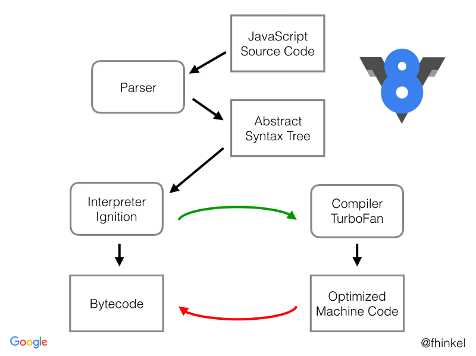

# JS性能优化
在V8引擎下，引入了`TurboFan`编译器，他会在特定的情况下进行优化，将代码编译成执行效率更高的`Machine Code`

在这一过程中，JS会首先被解析为AST（抽象语法树），解析过程略慢。


Ignition会将AST转化成Bytecode，TurboFan负责编译出优化后的Machine Code，在执行效率上，Machine Code优于 Bytecode
1. 对于函数，避免声明嵌套函数（类也是函数），这样会造成函数的重复解析
```js
function test1() {
  function test2() {}
}
```

编译为 Machine Code的情况：
1. 如果一个函数被多次调用，并且参数一直传入同一个类型，那么V8就会认为该段代码可以编译成Machine Code。因为Machine Code 固定了类型，不需要再执行很多判断逻辑了。如果此时传入的参数类型发生改变，那么Machine Code就会被DeOptimized为Bytecode。DeOptimized次数较少就应该要保证传入的类型一致

另外编译器会对函数进行 Lazy-Compile（预解析），当函数没有执行的时候，会对函数进行一次预解析，直到代码被执行以后才会被解析编译。而对于马上调用的函数来说，预解析其实是多余的。其实给函数套上括号就可以了
```js
(function test() {
  // some code
})
```

# 图片优化
计算图片大小：
对于一个100px * 100px 的图片，图像中有 10000px的点，每一个px有4个通道（rgba），每一个通道1个字节（byte = 8bit），所以该图片大小为 10000 * 4 / 1024

## 图片加载优化
1. 不用图片
2. 移动端适配，裁剪加载
3. 小图使用base64
4. 使用雪碧图
5. 选择正确的图片格式：
   1. webp
   2. 小图使用png
   3. 大图使用jpeg
6. 懒加载


# DNS预解析
`<link rel="dns-prefetch" href="" >`

# 函数节流和防抖

# 预加载
`<link rel="preload" href="">`
预加载可以一定程度上降低首屏的加载时间，因为可以将一些不影响首屏但重要的文件延后加载

# 预渲染
`<link rel="prerender" href="http://example.com"> `

# 懒加载

# 懒执行

# CDN
我们可以将静态资源尽量使用 CDN 加载，由于浏览器对于单个域名有并发请求上限
可以考虑使用多个 CDN 域名。并且对于 CDN 加载静态资源需要注意 CDN 域名要与主站不同，否则每次请求都会带上主站的 Cookie，平白消耗流量。